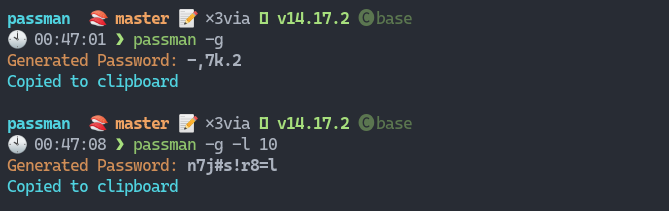

## passman

passman is a password manager for commandline written in Javascript. It supports in all OS[Linux, Windows, Mac].
It is a lighweight tool, which provides option to generate password and store it locally and securely. All the entries are stored at **passman/db/passwords.db**. 



## Prerequisites

- The system must have node version, latest version is preferred.

## How to Setup

```console
> git clone <repo_url>
```

```console
> cd passman
```

- Install the required dependencies

```console
> npm install
```
- To access it globally add symlink

```console
> npm link
```
- to remove the symlink

```console
> npm unlink
```
- to run command

```console
> passman <options>
Options:
  -V, --version                  output the version number
  -l,--length <number>           Length of the password (default: "6")
  -g, --passgen                  generated password
  -sl, --showlabel               Show all lablled passwords
  -ll,--label <label>            Label of the password
  -dl,--deletelabel <entry>      Label of the password to be deleted
  -pl,--picklabel <searchlabel>  Label for which password to get
  -p,--password <pass>           password to save
  -nn, --no-numbers              remove numbers
  -ns, --no-symbols              remove symbols
  -h, --help                     display help for command
```

## Contributor
- K N Anantha nandanan
